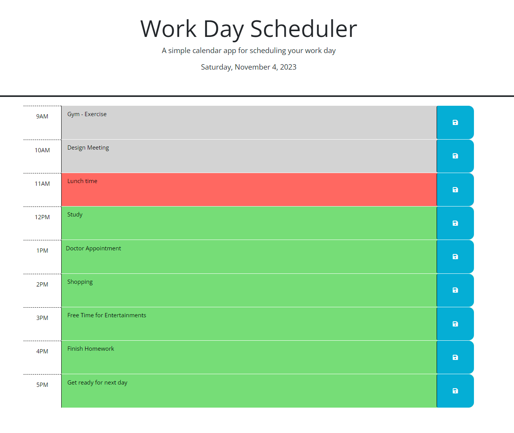

# Work Day Scheduler
A simple calendar application

## Description
This is a simple calendar application that allows a user to save events for each hour of a typical working day (9am&ndash;5pm). This app will run in the browser and feature dynamically updated HTML and CSS powered by jQuery. The information will be stored in the local storage.

### Purpose
AS an employee with a busy schedule
I want to add important events to a daily planner
so that I can manage my time effectively

## Website 

### URL
https://alamm01.github.io/taskscheduler/

### Screenshot

## Conclusion
Enjoy the app! Appreciate any feedback.